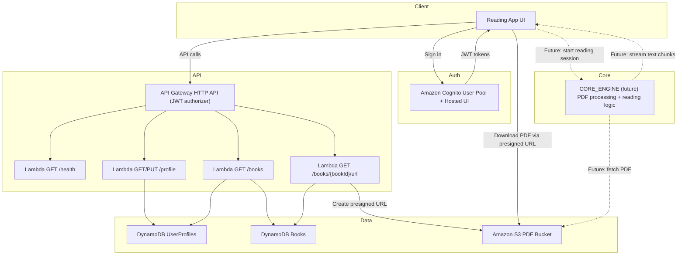

# Bookmark Reading – MVP Runbook

# Solution overview

This MVP provides a simple backend for a reading app:

• A student authenticates via Cognito Hosted UI.
• The app stores (or updates) the student’s profile attributes (first/last name and grade).
• The app lists books available for the student’s grade.
• When a book is selected, the backend returns a presigned S3 URL valid for 1 hour so the PDF can be downloaded/rendered by a UI.

What this MVP does not do yet:

• No teacher role, no collaboration/session workflow.
• No sentence-by-sentence reading flow or “core engine”.
• No automatic profile creation at sign-up (profile is created via the API).
• No admin API to manage the book catalogue (seeded directly into DynamoDB).

---

# Services used and deployed by CloudFormation

This solution is deployed via nested CloudFormation stacks.

| Service | What it’s used for | Created by |
|---|---|---|
| Amazon Cognito (User Pool + App Client + Hosted UI) | Authentication and JWT issuance | AuthStack.yml |
| Amazon API Gateway (HTTP API) | Public API endpoints protected by JWT validation | ApiStack.yml |
| AWS Lambda | API handlers (health, profile, list books, presign URL) | ApiStack.yml |
| Amazon DynamoDB | Persistent data: user attributes + book catalogue metadata | DataStack.yml |
| Amazon S3 | Storage of PDF book files | DataStack.yml |
| AWS CloudFormation (nested stacks) | Orchestration and dependency ordering | RootStack.yml |

---

# Architecture overview

| Stack | Responsibility |
|--------|----------------|
| RootStack.yml | Orchestrates all nested stacks and exposes final outputs |
| DataStack.yml | Creates DynamoDB tables + Books S3 bucket |
| AuthStack.yml | Creates Cognito User Pool + App Client + Hosted UI |
| ApiStack.yml | API Gateway + Lambdas (profile, books, URLs, health) |

---

# Architecture high-level diagram



---

# Runtime values and where they come from

## API Gateway
```
API=https://4kfn550ul2.execute-api.us-west-2.amazonaws.com
```

**What it is**  
Base URL of the backend API (profile, books, health).

**Provided by**  
ApiStack.yml → `Outputs.ApiBaseUrl`  
RootStack.yml → `Outputs.ApiBaseUrl`

---

## Cognito Hosted UI
```
HOST=https://bookmark-reading-bb.auth.us-west-2.amazoncognito.com
```

**What it is**  
Cognito managed login UI used to authenticate users and start OAuth flow.

**Provided by**  
AuthStack.yml → `Outputs.HostedUiBaseUrl`

---

## Cognito App Client
```
CLIENT_ID=32csubg36n61bg91sp0r4l1idl
```

**What it is**  
OAuth client used by Hosted UI and token exchange. Also the JWT audience.

**Provided by**  
AuthStack.yml → `Outputs.UserPoolClientId`  
RootStack.yml → `Outputs.UserPoolClientId`

---

## OAuth Redirect URI
```
REDIRECT=http://localhost:3000/callback
```

**What it is**  
Callback URL configured inside Cognito App Client.

**Defined in**  
AuthStack.yml (App Client config – not an output)

---

## Cognito User Pool
```
UserPoolId=us-west-2_5hs0HYAar
Issuer=https://cognito-idp.us-west-2.amazonaws.com/us-west-2_5hs0HYAar
```

**What it is**  
User directory + JWT issuer.

**Provided by**  
AuthStack.yml → `Outputs.UserPoolId`  
AuthStack.yml → `Outputs.UserPoolIssuerUrl`

---

## Books S3 bucket
```
BOOKS_BUCKET=656227834258-bookmark-reading-bb-books-s3
```

**What it is**  
Holds PDF books.

**Provided by**  
DataStack.yml → `Outputs.BooksBucketName`  
RootStack.yml → `Outputs.BooksBucketName`

---

## DynamoDB tables

```
BOOKS_TABLE=Books
PROFILES_TABLE=UserProfiles
```

**What they are**  
Books – metadata (grade, title, s3Key)  
UserProfiles – per‑user data (name, grade)

**Provided by**  
DataStack.yml → Outputs  
RootStack.yml → Outputs

---
---
---

# End‑to‑end testing

## Prerequisites

You must have:

- Root stack deployed successfully
- A user created in Cognito User Pool
- Browser access
- `curl` and `jq` installed locally

---

## Stack outputs used

These values come from **RootStack → Outputs**:

| Output | Value |
|--------|-------|
| HostedUiBaseUrl | https://bookmark-reading-bb.auth.us-west-2.amazoncognito.com |
| UserPoolClientId | 32csubg36n61bg91sp0r4l1idl |
| ApiBaseUrl | https://4kfn550ul2.execute-api.us-west-2.amazonaws.com |

---

## 0. Health check - just checking if API responds

Set API environment variable:
```
API="https://4kfn550ul2.execute-api.us-west-2.amazonaws.com"
```
Run:
```
curl $API/health
```

Expected
```
{"ok":true}
```

---
## 1. Get authorization code (BROWSER)

**This step must be done in a browser – NOT CLI**

Open this URL:

```
https://bookmark-reading-bb.auth.us-west-2.amazoncognito.com/login?client_id=32csubg36n61bg91sp0r4l1idl&response_type=code&scope=openid+email+profile&redirect_uri=http://localhost:3000/callback
```

### What happens

1. Cognito login page opens
2. Log in using a user from the User Pool
3. Browser redirects to:

```
http://localhost:3000/callback?code=XXXXXXXX
```

4. Copy the **code** value from the browser address bar

Example:

```
AbCdEf123456
```

## 2. Login and get JWT

Paste the code here:
```
CODE=
```
Run the below:
```
CLIENT_ID=32csubg36n61bg91sp0r4l1idl
HOST=https://bookmark-reading-bb.auth.us-west-2.amazoncognito.com
REDIRECT=http://localhost:3000/callback

TOKEN=$(curl -s -X POST "$HOST/oauth2/token" \
  -H "content-type: application/x-www-form-urlencoded" \
  -d "grant_type=authorization_code&client_id=$CLIENT_ID&code=$CODE&redirect_uri=$REDIRECT" \
| jq -er '.id_token')

export TOKEN
```

Verify:

```
echo "TOKEN length: ${#TOKEN}"
```

---

## 3. Create user profile

Why: Cognito user ≠ DynamoDB profile.

```
curl -X PUT "$API/profile" \
 -H "Authorization: Bearer $TOKEN" \
 -H "content-type: application/json" \
 -d '{"firstName":"Kid","lastName":"Test","grade":3}'
```

Verify
```
curl "$API/profile" -H "Authorization: Bearer $TOKEN"
```

**MVP gap**  
Profile is NOT auto‑created.

**Full solution**  
Would use **Cognito PostConfirmation trigger** to auto‑create profile.

---

## 4. Register books in DynamoDB

Assumes PDFs already exist in S3:

• L.2 - Bathtub Safari.pdf  
• L.3 - Monkey Business.pdf  
• L.3 - The Lion who Wouldn't Try.pdf

### Insert metadata

```
aws dynamodb put-item --table-name Books --item '{
 "bookId":{"S":"book-l2-bathtub"},
 "grade":{"N":"2"},
 "title":{"S":"Bathtub Safari"},
 "s3Key":{"S":"L.2 - Bathtub Safari.pdf"}
}'
```

```
aws dynamodb put-item --table-name Books --item '{
 "bookId":{"S":"book-l3-monkey"},
 "grade":{"N":"3"},
 "title":{"S":"Monkey Business"},
 "s3Key":{"S":"L.3 - Monkey Business.pdf"}
}'
```

```
aws dynamodb put-item --table-name Books --item '{
 "bookId":{"S":"book-l3-lion"},
 "grade":{"N":"3"},
 "title":{"S":"The Lion who Wouldn\"t Try"},
 "s3Key":{"S":"L.3 - The Lion who Wouldn\"t Try.pdf"}
}'
```

**MVP gap**  
No API for managing books.

**Full solution**  
Admin‑only `POST /books` secured by Cognito groups.

---

## 5. List books

```
curl "$API/books" -H "Authorization: Bearer $TOKEN"
```

Uses:
• Reads profile grade  
• Queries DynamoDB GSI by grade

---

## 6. Get presigned URL

```
curl "$API/books/book-l3-monkey/url" \
 -H "Authorization: Bearer $TOKEN"
```

Downloads
```
URL=$(curl -s "$API/books/book-l3-monkey/url" -H "Authorization: Bearer $TOKEN" | jq -r .url)
curl -L -o monkey.pdf "$URL"
```

URL valid for 1 hour.

---

# How stacks integrate

Cognito → issues JWT  
JWT → validated by API Gateway  
API → Lambdas execute  
Lambdas → DynamoDB (profiles + books)  
Lambdas → generate S3 presigned URLs

---

# Summary

• Cognito handles authentication and issues JWTs  
• DynamoDB stores **persistent data** used by the MVP:
  - user attributes (firstName, lastName, grade) in `UserProfiles`
  - book catalogue metadata (grade, title, s3Key) in `Books`
• S3 stores the PDF book files  
• API Gateway exposes backend endpoints protected by JWT validation  
• Lambdas implement the API logic (read/write DynamoDB, generate S3 presigned URLs)

---

# Solution decriprion and testing scenario

• Solution described and diagrammed in the SolutionCFN/README.md
• Please enter the SolutionCFN folder for github to display it.

---


